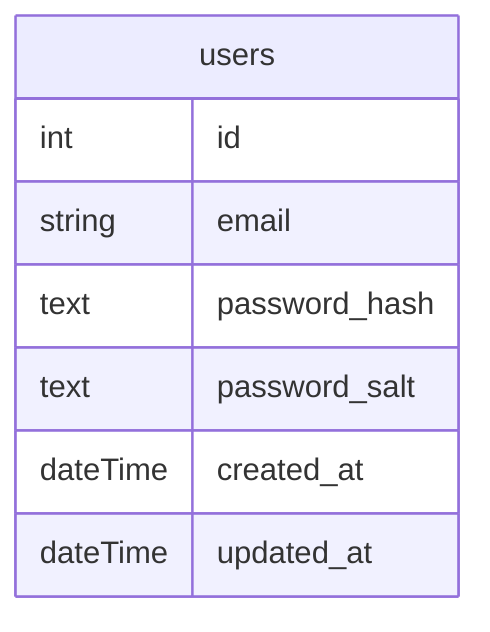

# BSA-2022 | Streamlet

## ℹ️ General Info

This is the repository responsible for Streamlet's apps.

## 🏭 Applications

- [Backend](./backend) — Streamlet's application backend.

  _To work properly, fill in the **`.env`** file. Use the **`.env.example`** file as an example._

- [Frontend](./frontend) — Streamlet's application frontend.

  _To work properly, fill in the **`.env`** file. Use the **`.env.example`** file as an example._

- [Shared](./shared) — Streamlet's application common modules for reuse.

## 🖍 Requirements

- [NodeJS](https://nodejs.org/en/) (16.x.x);
- [NPM](https://www.npmjs.com/) (8.x.x);
- [PostgreSQL](https://www.postgresql.org/) (14.0)
- run **`npx simple-git-hooks`** at the root of the project, before the start (it will set the [pre-commit hook](https://www.npmjs.com/package/simple-git-hooks) for any commits).

## 🏃‍♂️ Simple Start

1. Fill ENVs
2. **`npm install`** at the root
3. **`npx simple-git-hooks`** at the root
4. Enjoy <3

## Code Quality

Static analyzers are used for both frontend and backend projects to ensure basic code quality. Additionally, [quality criteria](https://github.com/BinaryStudioAcademy/quality-criteria/blob/production/source/javascript.md) rules are enforced during code review and audit.

## Architecture

### 🏗 Application Schema

**TODO**

### 💽 DB Schema



## 🧑‍💻 CI

### 🗜 Tools

### 🌑 Backend

- [Express](https://expressjs.com/) – a backend framework.
- [InversifyJS](https://inversify.io) - an IoC container
- [Prisma](https://www.prisma.io/) – an ORM.

### 🌕 Frontend

- [React](https://reactjs.org/) – a frontend library.
- [Redux](https://redux.js.org/) + [Redux Toolkit](https://redux-toolkit.js.org/) – a state manager.

#### 🥊 Code quality

- [simple-git-hooks](https://www.npmjs.com/package/simple-git-hooks) — a tool that lets you easily manage git hooks.
- [lint-staged](https://www.npmjs.com/package/lint-staged) — run linters on git staged files.
- [editorconfig](https://editorconfig.org/) — helps maintain consistent coding styles for multiple developers working on the same project across various editors and IDEs.
- [prettier](https://prettier.io/) — an opinionated code formatter.
- [ls-lint](https://ls-lint.org/) — file and directory name linter.
- [eslint](https://eslint.org/) – find problems in your JS code
- [stylelint](https://stylelint.io/) – Find and fix problems in your CSS code

### 🗞 Git

#### 📊 Branches

- **`production`** - production source code.
- **`development`** - staging source code.

#### 🌳 Branch flow

```
<type>/<project-prefix><ticket-number>-<short-desc>
```

##### Types:

- task
- fix

##### Examples:

- `task/design5-add-signin-page`
- `task/blog12-add-filters`
- `fix/design16-fix-signup-validation`

#### 🗂 Commit flow

```
<project-prefix>-<ticket-number>: <modifier> <desc>
```

##### Modifiers:

- `+` (add)
- `*` (edit)
- `-` (remove)

##### Examples:

- `blog-5: + form component`
- `design-12: * filter markup`
- `blog-16: - require prop for nickname field`

## 📦 CD

[Handled](.github/workflows/cd.yml) by [GitHub Actions](https://docs.github.com/en/actions).
